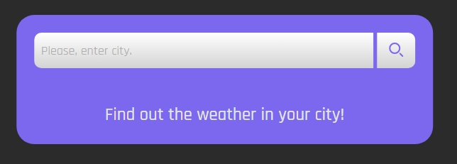
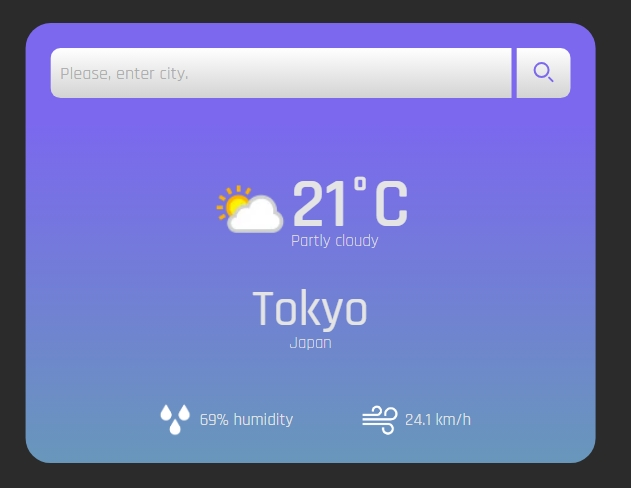
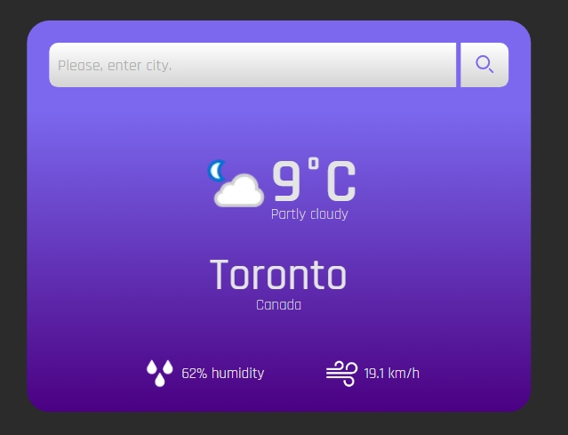

# Weather App

Project to find out the weather forecast for a specific city and its country using libraries:

- React v18
- React router v6
- RTK Query
- use-debounce

## Usage

This `Weather App` begins with a search block, where we need to enter the city we need into the input:

## After

When we receive a weather forecast, we can have two visually distinguishable results:

__First outcome:__
When the time of day for the specified city and country is `Day`:

__Second outcome:__
When the time of day for the specified city and country is `Night`:

### Conclusion
Of course, we can re-enter new cities into the finished data block and get an updated result with a weather forecast! :)